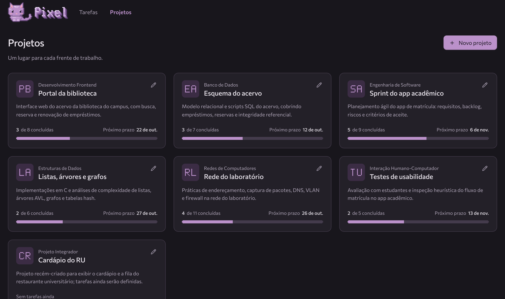
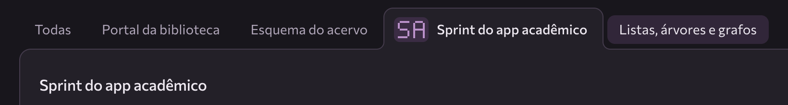
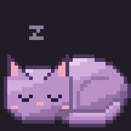
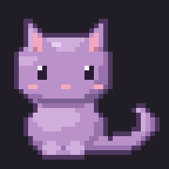
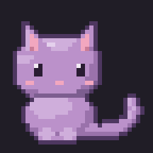
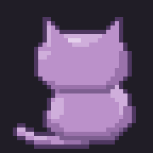

<h1 align="center">Pixel</h1>

<p align="center">
  <strong>Seus projetos acadêmicos, em um só lugar.</strong><br>
  Organize tarefas, acompanhe prazos e veja suas entregas avançarem.
</p>

<h3 align="center"><a href="https://pixel-dfe-project.up.railway.app/">Acesse a Pixel</a></h3>

<p align="center">
  <sub>Lista e kanban · Busca e filtros · Interface responsiva</sub>
</p>

<p align="center">
  <a href="https://pixel-dfe-project.up.railway.app/">
    
  </a>
</p>

## Do projeto à próxima tarefa

- **Projetos organizados:** acompanhe disciplinas, tarefas concluídas e o próximo prazo.
- **Lista ou kanban:** escolha sua visão e encontre tarefas com busca e filtros.
- **Tudo à mão:** crie, edite e exclua tarefas; ajuste status, prioridade e responsável.
- **Sem perder o contexto:** abra detalhes e formulários em fichas sobre a página.



## Personalidade em cada detalhe

O gatinho acompanha os estados da aplicação com animações em pixel art, do carregamento às telas vazias.

<p align="center">
  
  
  
  
  
  
</p>

Navegação por teclado, foco visível e respeito à preferência por movimento reduzido.

<sub>Desenvolvido com React e TypeScript.</sub>

## Como rodar

Requer **Node.js 24 ou superior**, com npm. Na pasta do projeto:

```bash
npm ci
```

Em um terminal, inicie a API em `http://localhost:3000`:

```bash
npm run api
```

A API lê e grava no `db.json`, que traz os dados de demonstração; `git checkout db.json` desfaz o que você gravar ao experimentar. O `db.seed.json` preserva os dados iniciais da disciplina e serve de base para os testes.

Em outro terminal, na mesma pasta, inicie a aplicação:

```bash
npm run dev
```

Abra o endereço mostrado pelo Vite, normalmente `http://localhost:5173`. Mantenha os dois terminais abertos.

Para verificar o TypeScript e gerar os arquivos de produção em `dist/`:

```bash
npm run build
```

## Equipe

Equipe **Pixel**. Projeto da disciplina **Desenvolvimento Frontend**, ULBRA — 2026.2.

- Gabriela de Araújo Reis
- Euclides Carlos Pilon Neto
- Linnek Lima de Araujo

[Créditos e licenças](public/design-licenses/THIRD_PARTY_NOTICES.txt)
